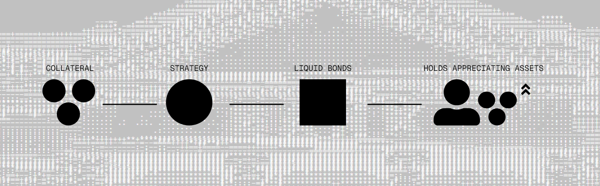

# reflect-routing

Reflect Protocol AMM interfacte for integration with the Jupiter Router.

## What is Reflect?

Reflect is credibly-neutral stablecoin software, where the software consists of decentralised financial strategies executed and managed permissionlessly by programs on SVM, rather than managed by humans. Reflect then tokenises these strategies in the form of interest-bearing US Dollars (stablecoins).




## Development

```bash
# Run tests.
cargo test  -- --nocapture
```